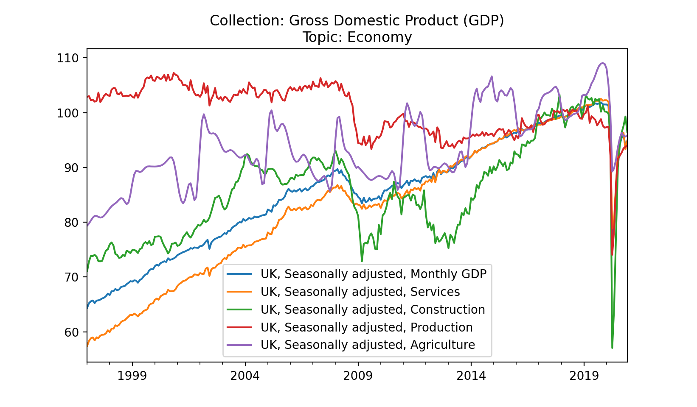

=============
Example Usage
=============

.. code-block:: python

   import matplotlib.pyplot as plt
   from tqdm import tqdm

   from leveropen import Lever

   lever = Lever(access_token="your-unique-access-token")
   dataset = lever.get_datasets_by_collection("Gross Domestic Product (GDP)")[0]
   fig, ax = plt.subplots()
   for series in tqdm(dataset.get_series(), desc="Parsing series objects", unit="SeriesObjects"):
       data = series.get_data()["Value"]
       data.plot(
           title=f"Collection: {dataset.collection}\nTopic: {dataset.topic}",
           ax=ax,
           label=series.name,
       )
   ax.legend()
   plt.show()

*Console:*

.. code-block:: console

   Parsing datasets: 100%|██████████| 1/1 [00:00<00:00, 321.95datasets/s]
   ✔ Loading datasets successful
   ✔ Loading series data successful
   Parsing series: 100%|██████████| 5/5 [00:00<00:00, 19765.81series/s]
   Parsing series objects: 100%|██████████| 5/5 [00:05<00:00,  1.16s/SeriesObjects]

.. note::
   The above example uses the python package |matplotlib_link|

.. |matplotlib_link| raw:: html

   <a href="https://matplotlib.org/stable/users/installing.html" target="_blank">matplotlib</a>

.. seealso::

   - :func:`leveropen.lever.Lever`
   - :func:`leveropen.dataset.Dataset`
   - :func:`leveropen.l_series.LSeries`

